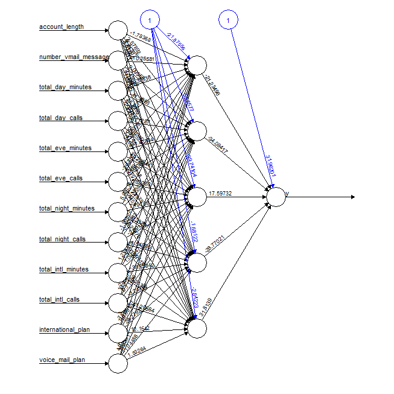

```{r echo=FALSE, warning=FALSE, message=FALSE}
#This part is added as we use R markdown and everytime we run separate file we need to load the data and prepare the data.
library(ggplot2) #graphics library
library(corrplot) #correlation charts
library(devtools) #required by bcgstyle
library(rpart) # CART model
library(C50) # C50 and Rule-Based classification models
library(randomForest) #Random forest model
library(neuralnet) #Neural network model
library(pROC) # ROC curve and AUC metric
data(churn)

var.out <- c("state", "churn", "total_day_charge", "total_eve_charge",  "total_night_charge",  "total_intl_charge")
var.out.index <- which(names(churnTest) %in% var.out)
churnTest_x <- churnTest[,-var.out.index]
churnTrain_x <- churnTrain[,-var.out.index]

# Create train and test data sets for target variable "churn"
churnTest_y <- churnTest[,c("churn")]
churnTrain_y <- churnTrain[,c("churn")]
y_Test_Table <- table(churnTest_y)
y_Train_Table <- table(churnTrain_y)

# Initialize data structures for storing models information and performance
Confusion_Matrix <- list()
Models_specs <- vector()
Num_models <- 0

```


## Random Forest Model Estimation

The random forest model has the best performance in terms of false negative rates as well as false positive rates.

```{r}
# Random Forest - Estimate Model
set.seed(123) # Setting seed to ensure consistency of results in each run
RandomForest_Fit <- randomForest(x = churnTrain_x, y = churnTrain_y, importance = TRUE, ntree = 600)

# Random Forest - Predictions and confusion matrix for test data set
RandomForest_Test_Predictions <- predict(object = RandomForest_Fit, newdata = churnTest_x, type = "response")
RandomForest_Confusion_Matrix <- table(RandomForest_Test_Predictions, churnTest_y)
RandomForest_Confusion_Matrix_Perc <- t(apply(RandomForest_Confusion_Matrix,1,"/",y_Test_Table))

# Random Forest - Stores confusion matrix for comparison
Num_models <- Num_models + 1
Confusion_Matrix[[Num_models]] <- RandomForest_Confusion_Matrix_Perc
Models_specs[Num_models] <- "Random Forest Model"

# Random Forest - Plot error rate (total and for churn yes/no) and print confusion matrix
plot(RandomForest_Fit)
varImpPlot(RandomForest_Fit, sort=TRUE, cex =0.5, n.var = 10, type = 1, main = "Random Forest Model - Variables Importance")
print(RandomForest_Confusion_Matrix_Perc)
```

## Neural Networks Model Estimation

### Data Preparation

The data need to be transformed in order to effectively train a neural network. More specifically:

* numerical variables should be standardized in the 0-1 range
* binary variables expressed in terms of "yes"/"no" should be converted to a numeric binary
* categorical variables (e.g. states, zip codes, etc.) should be transformed in binary variables, where each variable is a binary representation of one of the categories


```{r}
# Creation of binary  variables for the three area codes in the data set
# Area code datafames initialization
Area_code_Train <- data.frame(matrix(ncol = 3, nrow = nrow(churnTrain)))
names(Area_code_Train) <- c("A_408","A_415","A_510")
Area_code_Test <- data.frame(matrix(ncol = 3, nrow = nrow(churnTest)))
names(Area_code_Test) <- c("A_408","A_415","A_510")
# Area code datafames fill with binary data
Area_code_Train[,1] = ifelse(churnTrain[,3]=='area_code_408',1,0)
Area_code_Train[,2] = ifelse(churnTrain[,3]=='area_code_415',1,0)
Area_code_Train[,3] = ifelse(churnTrain[,3]=='area_code_510',1,0)
Area_code_Test[,1] = ifelse(churnTest[,3]=='area_code_408',1,0)
Area_code_Test[,2] = ifelse(churnTest[,3]=='area_code_415',1,0)
Area_code_Test[,3] = ifelse(churnTest[,3]=='area_code_510',1,0)

# Create train and test data sets for neural netwoek input variables
# Drop "state", "area code" and "churn" variables, as well as "charge" variables with perfect positive correlation
var.out.nn <- c("state", "area_code", "churn", "total_day_charge", "total_eve_charge",  "total_night_charge",  "total_intl_charge")
var.out.nn.index <- which(names(churnTest) %in% var.out.nn)
churnTrain_NN_x <- churnTrain[,-var.out.nn.index]
churnTest_NN_x <- churnTest[,-var.out.nn.index]
# Move binary variables to the right of the data frames
churnTrain_NN_x <- churnTrain_NN_x[c(1,4,5,6,7,8,9,10,11,12,2,3)]
churnTest_NN_x <- churnTest_NN_x[c(1,4,5,6,7,8,9,10,11,12,2,3)]

# Standardize numeric variables
# Retrieves mins and max for the numeric columns
max_ChurnTrain <- apply(churnTrain_NN_x[,1:10], 2, max) 
min_ChurnTrain <- apply(churnTrain_NN_x[,1:10], 2, min)
max_ChurnTest <- apply(churnTest_NN_x[,1:10], 2, max) 
min_ChurnTest <- apply(churnTest_NN_x[,1:10], 2, min)

# Standardize numeric variables in the 0 - 1 range
churnTrain_NN_x[,1:10] <- as.data.frame(scale(churnTrain_NN_x[,1:10], center = min_ChurnTrain, scale = max_ChurnTrain - min_ChurnTrain))
churnTest_NN_x[,1:10] <- as.data.frame(scale(churnTest_NN_x[,1:10], center = min_ChurnTest, scale = max_ChurnTest - min_ChurnTest))

# Convert binary variables to 0 - 1
churnTrain_NN_x[,11] = ifelse(churnTrain_NN_x[,11]=='yes',1,0)
churnTrain_NN_x[,12] = ifelse(churnTrain_NN_x[,12]=='yes',1,0)
churnTest_NN_x[,11] = ifelse(churnTest_NN_x[,11]=='yes',1,0)
churnTest_NN_x[,12] = ifelse(churnTest_NN_x[,12]=='yes',1,0)

# Create target variable as 0 - 1 binary
churnTrain_NN_y = ifelse(churnTrain_y=='yes',1,0)
churnTest_NN_y = ifelse(churnTest_y=='yes',1,0)

# Create the final training and test data sets
churnTrain_NN_x <- cbind(churnTrain_NN_x, Area_code_Train, churnTrain_NN_y)
churnTest_NN_x <- cbind(churnTest_NN_x, Area_code_Test, churnTest_NN_y)
colnames(churnTrain_NN_x)[16] <- "y"
colnames(churnTest_NN_x)[16] <-"y"
```

The training of a neural network is an iterative process where the estimation parameters are progressively tweaked. After defining the reference formula, a data structure is created to store the outcome of each iteration.

```{r}
# Create the formula
input_variables <-colnames(churnTrain_NN_x)[1:12]
formula_NN <- as.formula(paste("y ~",paste(input_variables, collapse = " + ")))

# Create the data structure to store neural networks information
Neural_Networks = list() # List where the nn objects are stored
NN_Structure = list()    # List with the information on the nn layers
NN_Test_Predictions = list() # List to store the predictions produced with the different neural networks
NN_Confusion_Matrix = list() # List of confusion matrices with number of predictions
NN_Confusion_Matrix_Perc = list() # List of confusion matrices with percentages
NN_Index <- 0
```

After some iterations based on a relatively large learning rate, the training is performed on a learning rate = .01. Neural networks with one hidden layer and a number of nodes ranging from 2 to 5 are trained. 

```{r eval=FALSE}
# Training of neural networks with one hidden layer
for (hidden1 in 2:4){
  NN_Index <- NN_Index + 1
  NN_Structure[[NN_Index]] <- c(hidden1,0)
  Neural_Networks[[NN_Index]] <- neuralnet(formula_NN,data=churnTrain_NN_x,hidden=c(hidden1),linear.output= FALSE, rep = 1, algorithm = "backprop", learningrate = 0.01, stepmax = 1e6)
  print(NN_Index)
  print(Neural_Networks[[NN_Index]])
  }
```

The network with 5 nodes in the hidden layer shows the best training performance. 

```{r eval=FALSE}
plot(Neural_Networks[[4]], cex=0.5)
```


The five neural networks successfully trained (with 2,3, 4 and 5 hidden nodes, respectively) are evaluated against the test dataset. The only network showing a performance close to other models is the 5-node network. 

```{r}
# Generate predictions and cross-validation stats for the neural networks successfully trained
load(file="NN_Churn.RData") #Load the data on the Neural Networks structure

for (j in 1:5){
        # Generate Predictions
        NN_Test_Predictions[[j]] <- compute(Neural_Networks[[j]], churnTest_NN_x[,1:12])$net.result
        NN_Test_Predictions[[j]] <- ifelse(NN_Test_Predictions[[j]]>0.5,"yes","no")  
        # Compute Confusion Matrix
        NN_Confusion_Matrix[[j]] <- table(NN_Test_Predictions[[j]], churnTest_y)
        NN_Confusion_Matrix_Perc[[j]] <- t(apply(NN_Confusion_Matrix[[j]],1,"/",y_Test_Table))
        NN_Confusion_Matrix_Perc[[j]] <- NN_Confusion_Matrix_Perc[[j]][c(2,1),]
        # Store confusion matrix for comparison with other models
        Num_models <- Num_models + 1
        Confusion_Matrix[[Num_models]] <- NN_Confusion_Matrix_Perc[[j]]
        Models_specs[Num_models] <- paste("Neural Network - ",NN_Structure[[j]][1]," Nodes")
        print(Models_specs[Num_models])
        print(Confusion_Matrix[Num_models])
}
```

There is the possibility to improve the performance of the 5-node Neural Network by fine-tuning the churn threshold decision criteria.

For example, the threshold for deciding between "churn" and "no churn" can be selected in order to optimize the trade-off between True and False positives. 


```{r echo = FALSE}
# Generate predictions with different types of NN configuration
# Specify the number of predictions, the neural network to be tested (NN_ID) and the threshold for deciding the churnprediction number (pred_num) and the neural network to be used (NN_ID)
Pred_num <- 100 # Number of predictions
NN_ID <- seq(from = 4, to = 4, length.out=100) ## Neural network to be used
Churn_threshold <- seq(from = 0.2, to = 0.1, length.out = 100) # Thresholds
NN_Test_Predictions <- as.list(Pred_num)
NN_Test_Predictions_bin <- as.list(Pred_num)
NN_Confusion_Matrix <- as.list(Pred_num)
NN_Confusion_Matrix_Perc <- as.list(Pred_num)
True_positives_NN <- as.vector(Pred_num)
True_negatives_NN <- as.vector(Pred_num)
False_positives_NN <- as.vector(Pred_num)
False_negatives_NN <- as.vector(Pred_num)

for (j in 1:Pred_num){
  # Generate Predictions
  NN_Test_Predictions[[j]] <- compute(Neural_Networks[[NN_ID[j]]], churnTest_NN_x[,1:12])$net.result
  NN_Test_Predictions_bin[[j]] <- ifelse(NN_Test_Predictions[[j]]>Churn_threshold[j],"yes","no")  
  # Compute Confusion Matrix
  NN_Confusion_Matrix[[j]] <- table(NN_Test_Predictions_bin[[j]], churnTest_y)
  NN_Confusion_Matrix_Perc[[j]] <- t(apply(NN_Confusion_Matrix[[j]],1,"/",y_Test_Table))
  NN_Confusion_Matrix_Perc[[j]] <- NN_Confusion_Matrix_Perc[[j]][c(2,1),]
  True_positives_NN[j] <- NN_Confusion_Matrix_Perc[[j]][1,1]
  True_negatives_NN[j] <- NN_Confusion_Matrix_Perc[[j]][2,2]
  False_positives_NN[j] <- NN_Confusion_Matrix_Perc[[j]][1,2]
  False_negatives_NN[j] <- NN_Confusion_Matrix_Perc[[j]][2,1]
  }

```

```{r echo=FALSE}
        Num_models <- Num_models + 1
        Confusion_Matrix[[Num_models]] <- NN_Confusion_Matrix_Perc[[93]]
        Models_specs[Num_models] <- paste("Neural Network - 5 Nodes - Optimized")
        print(Models_specs[Num_models])
        print(Confusion_Matrix[Num_models])
```


```{r}
#Select as source predictions the Random Forest, and the Neural Network 5 nodes with 75% True Positives, 81% True Negatives 
Source_Predictions <- as.data.frame(cbind(RandomForest_Test_Predictions, NN_Test_Predictions_bin[[100]]))
Source_Predictions[,1] = ifelse(Source_Predictions[,1]==1,1,0)
Source_Predictions[,2] = ifelse(Source_Predictions[,2]=="yes",1,0)
colnames(Source_Predictions) <- c("Random Forest",  "NN 5 Nodes")
churnTest_y_Num = ifelse(churnTest_y=="no",0,1)
```

## Conclusions

The _Random Forest_ model has shown the best performance - as an individual model - when evaluated against the test dataset. The _Neural Network_ performance could be further improved by either fine-tuning the training parameters or modifying the network structure.

The most interesting result is from the _Ensemble_ model which provides the best classification performance, with a True Positive rate above 70%.

```{r echo=FALSE}
Confusion_Matrix_DF <- data.frame(matrix(ncol=4,nrow=Num_models))
colnames(Confusion_Matrix_DF) <- c("True Pos", "False Neg", "False Pos", "True Neg")
row.names(Confusion_Matrix_DF) <- Models_specs
Confusion_Matrix_DF[,1] <- round(t(sapply(Confusion_Matrix, function(x) x[1,1]))[1:Num_models], digits=3) # True Positives
Confusion_Matrix_DF[,2] <- round(t(sapply(Confusion_Matrix, function(x) x[2,1]))[1:Num_models], digits=3) # False Negatives
Confusion_Matrix_DF[,3] <- round(t(sapply(Confusion_Matrix, function(x) x[1,2]))[1:Num_models], digits=3) # False Positives
Confusion_Matrix_DF[,4] <- round(t(sapply(Confusion_Matrix, function(x) x[2,2]))[1:Num_models], digits=3) # True Negatives
print(Confusion_Matrix_DF)
```

Both the _ROC curve_ chart and the _Area Under the Curve (AUC)_ stats confirm the _Random Forest_ model as better performance in predicting churn:

```{r}

# Compute ROC curve stats
RandomForest_ROC <- roc(response = churnTest_y_Num, predictor = Source_Predictions[,1])
NN5_ROC <- roc(response = churnTest_y_Num, predictor = Source_Predictions[,2])

# Plot AUC curves- for more info about recall and percision please check: https://en.wikipedia.org/wiki/Precision_and_recall
par(pty="s")
plot(RandomForest_ROC$sensitivities,RandomForest_ROC$specificities, col = "blue", type="l",asp=1,xlab="",ylab="")
par(new=TRUE)
plot(NN5_ROC$sensitivities,NN5_ROC$specificities, col = "black", type="l",asp=1,xlab="Sensitivities/Recall",ylab="Specificities/Percision")

legend(x = "bottomleft", c("Random Forest", "Neural Network 5"), lty=c(1,1), lwd=c(2.5,2.5),col=c("blue","black"))

# Print AUC stats
print(RandomForest_ROC$auc)
print(NN5_ROC$auc)
```


