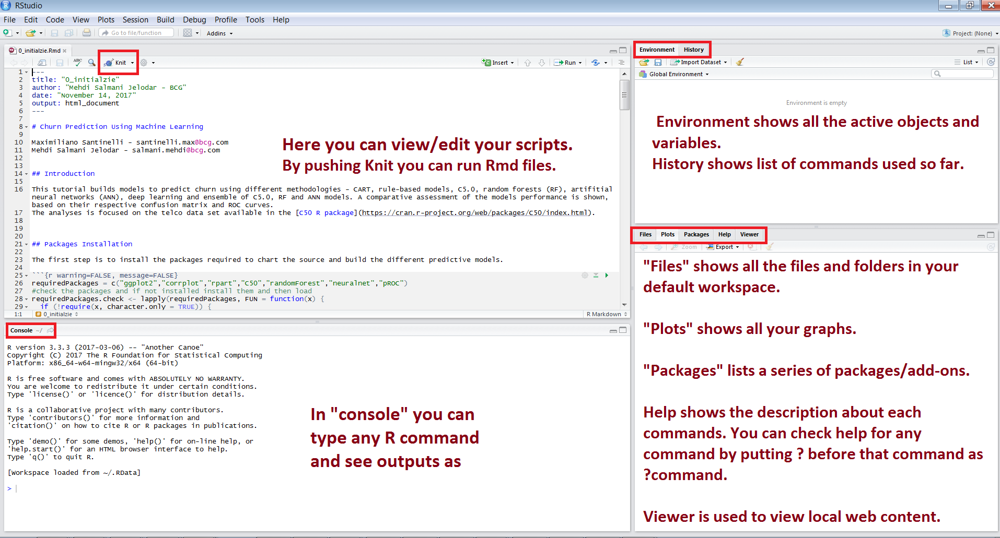
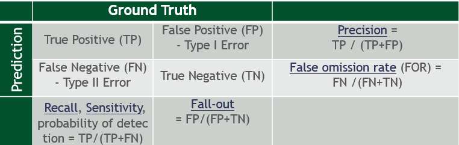

# MIT AI MasterClass By BCG GAMMA

### Goal 
**Identify customer churn for a telcom company using data science methods in R. R is one the most populare languages among data scientists and statisticians.**

### Problem description
**A telco company's revenue is based on a subscription service. As customer acquisition costs increase, the company sees management of existing customer churn as a key driver of increasing margins. Here, we aregoing to try to predict which customers are going to churn and what are the underlaying factors for that. These can empower the company to be more targeted in their investments to retain them.**
 

### Solution
- Please download all these 5 files into your laptop:

1. [0_initialzie.Rmd](./0_initialzie.Rmd)

2. [123_Data_Prepration_and_Visualization.Rmd](./123_Data_Prepration_and_Visualization.Rmd)

3. [456_ModelingAndPerformanceEvaluations.Rmd](./456_ModelingAndPerformanceEvaluations.Rmd)

4. [Neural_Network_5_Nodes.png](./Neural_Network_5_Nodes.png)

5. [NN_Churn.RData](./NN_Churn.RData)

- Open Rstudio on your laptop and you should see R studio as:

 

- **Step 0:** Open (Ctrl+O) all Rmd files in order based on the number at the begining of each file's name

- **Step 1:** First run __[0_initialzie.Rmd](./0_initialzie.Rmd)__ using Knit buttom or by pushing Ctrl+Shift+k. It installes the required packages and load pacakages then load the data and does initial data checking.

__Expected output:__ 

After loading packages, list of loaded packages: 
 

After loading data, number of rows and number of columns for train and test data sets: 
 

- **Step 2:** Then, run __[123_Data_Prepration_and_Visualization.Rmd](./123_Data_Prepration_and_Visualization.Rmd)__ using Knit or by pushing Ctrl+Shift+k.

 

__Expected output:__ 

Correlation plot shows the strong correlation between few variables:

 
 
Visualizing some variables againt churn somtimes shows some insigful patterns:
 

 

- **Step 3:** Then, run __[456_ModelingAndPerformanceEvaluations.Rmd](./456_ModelingAndPerformanceEvaluations.Rmd)__ using Knit or by pushing Ctrl+Shift+k.

 

 

__Expected output:__ 
One of the major outputs from Random Forest is the _variable importance_:

 

ROC (Receiver Operating Characteristic) curve illustrates the diagnostic ability of a binary classifier system as its discrimination threshold is varied. It is another way of seeing the percision and recall together in a plot:

 

ROC curves for Neural Network vs. Random Forest:

 

### Conclusions: 
- Data prepration can be tedious and time consuming but it is a very important step for any data science project.

- Complex models are not neccesserily better than simpler methods. Here, Random forest outperforms Neural Network both in performance and computation time. But if we had larger data set probably neural network would have done a better job.

### Further readings: 

- [Deep Learning Specialization](https://www.coursera.org/specializations/deep-learning)   

- [Statistics With R Specialization](https://www.coursera.org/specializations/statistics)   

- [Statistical Learning - Stanford](https://lagunita.stanford.edu/courses/HumanitiesSciences/StatLearning/Winter2016/about) 

